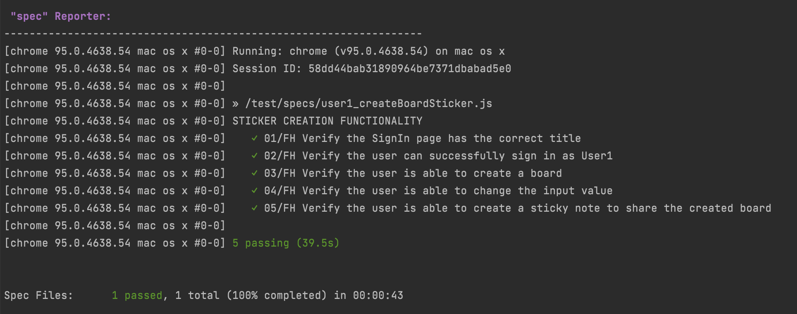
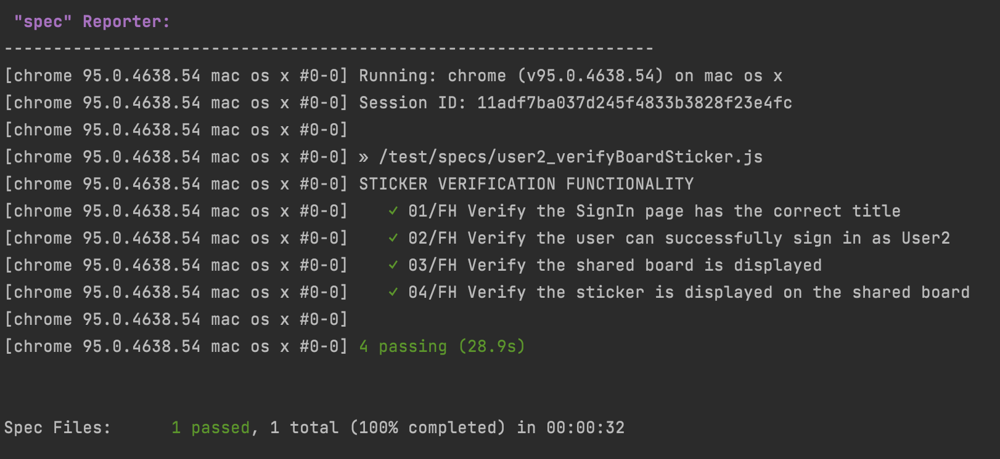

### README

Project name:  MIRO service.

Website: https://miro.com/login/

### Summary
This  automation test mainly targets the GUI testing and validating data as per provided Requirements / Specifications / Test Case.

### Features to be tested:
- Sticker creation functionality by User1
- Sticker verification functionality by User2

### Primary Objectives
A primary objective of testing is to assure that the system meets the full requirements and satisfies the use case scenario / e2e test.

### Test framework
Data Driven Automation Testing using WebdriverIO, Mocha JS testing framework with Chai assertion library.
- The scripting language is JavaScript.
- To follow the coding standards, ESLinter is adapted.
- Web browser: Google Chrome.
- Test report generator — “spec” Reporter
- For run/debug test — Webstorm IDE.
- For version control — GitHub.
- For running asynchronous commands is installed the “@wdio/sync”.

The **data** directory includes:
- expected.json —>  expected data,
- selectors.json —>  all locators/selectors,
- testData  —>  credentials for testing.

The **helper** directory includes:
- methods.js —> JS function for sign in functionality (for both users)

The **test/specs** directory includes two running spec files:
1. user1_createBoardSticker.js
2.  user2_verifyBoardSticker.js

### Prerequisites

1. User1 and User2 should be already registered.
   All signing in credentials are collected in the data/testData.json file.
2. User1 and User2 should not have created boards.
   “All boards” container should be empty for User1.

### Running Tests

The following set up steps for running WebdriverIO tests locally:
1. Clone this repository to the local machine
2. Install all dependencies
   `npm install`
3. Open up a terminal, navigate to the project directory and run the tests in following order:

    For User1(“Sticker creation functionality”): `npm test user1_createBoardSticker.js`
    
    For User2(“Sticker verification functionality”): `npm test user2_verifyBoardSticker.js`

### Reports

"spec" Reporter

"spec" Reporter

